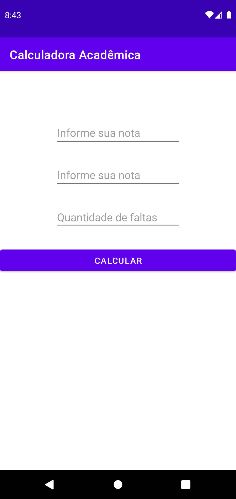
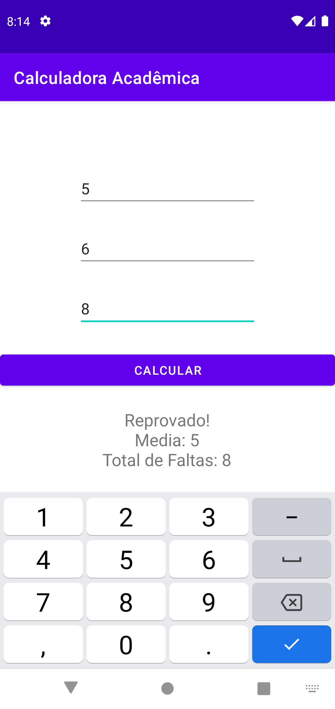

# Calculadora acadêmica de notas
## Projeto prático de desenvolvimento android usando Kotlin

*Aluno será aprovado com média maior ou igual a 7 e frequência menor igual a 16, caso contrário, o aluno será reprovado.*

**Calculadora composta por três entradas de valores inteiros: duas para notas e uma para quantidade de faltas.**

